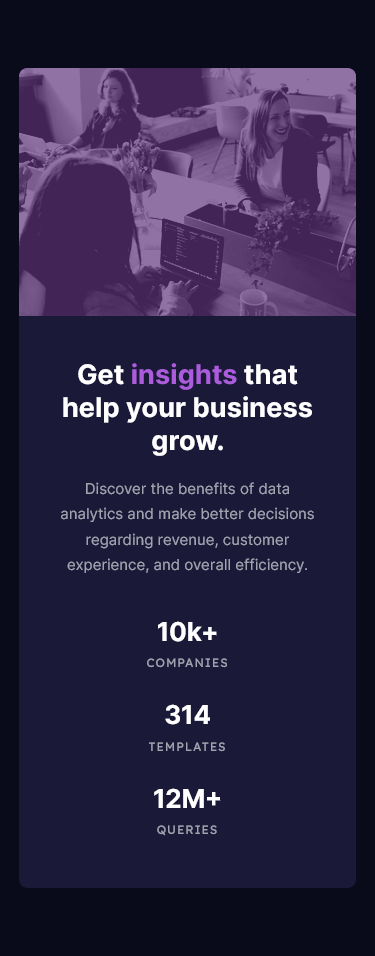

# Frontend Mentor - Stats preview card component solution

This is a solution to the [Stats preview card component challenge on Frontend Mentor](https://www.frontendmentor.io/challenges/stats-preview-card-component-8JqbgoU62). Frontend Mentor challenges help you improve your coding skills by building realistic projects.

## Table of contents

- [Overview](#overview)
  - [The challenge](#the-challenge)
  - [Screenshot](#screenshot)
  - [Links](#links)
- [My process](#my-process)
  - [Built with](#built-with)
  - [What I learned](#what-i-learned)
  - [Continued development](#continued-development)
  - [Useful resources](#useful-resources)
- [Author](#author)

## Overview

### Quick introduction

I'm an aspiring front-end developper which means that this project is probably not the best learning material, yet i'll do my best to explain parts of my process, what i did and for what reasons.
Also, on a separate subject, english isn't my first language so please excuse me for any mispellings or grammatical errors whatsoever.

### The challenge

Users should be able to:

- View the optimal layout depending on their device's screen size

### Screenshot

### Links

- Solution URL: [GitHub Repository](https://github.com/joanFaseDev/preview-card)
- Live Site URL: [Project hosted throught Vercel](https://preview-card-phi.vercel.app/)

## My process

### Analysis

- Two different designs, a mobile and a desktop one, so the page will be responsive.
- Card can be divided in three main parts: photo, text (title &sol; paragraph) &amp; metrics
- Can use CSS Grid here:
  - One column and three rows for the mobile design
  - Two columns and two rows for the desktop design
- At one point, use _media queries_ to change column numbers and switch from mobile design to desktop one.
- Will start by mobile design because it's easier to add complexity to a design than to remove it (mobile design have less space to cover and less elements to display so it's often better to start mobile first). Plus nowadays, most people use the web through mobile devices so it makes senses to focus the experience on the many instead of the few.
- Title seems to be bigger in desktop design but the other entries don't seem to change size.
- There's two images, one for the mobile design and the other for the desktop design. Will use the _picture_ and _source_ elements to make the switch.
- Both images are black &sol; white so we'll use _linear-gradient()_ to add the purplish color on top of it.

### Built with

- Semantic HTML5 markup
- CSS custom properties
- Flexbox
- CSS Grid

### What I learned

- I got a quick introduction to the filter CSS property

### Continued development

- I need more experience using relative length units. I feel view units are particularly strong and can even create responsive typography but it's a lot to handle and i need to do way more projects to be confortable manipulating them.

- I need to optimize the way i used media queries. There's a lot to improve on that part.

### Useful resources

- [MDN article on the _picture_ HTML element](https://developer.mozilla.org/en-US/docs/Web/HTML/Element/picture) - This helped me make the switch between the image from the mobile design and the one from the desktop design.

- [MDN article on the CSS _filter_ property](https://developer.mozilla.org/en-US/docs/Web/CSS/filter) - This helped me partially reproduce the purplish filter on the card's photo.

- [CSS Image Overlay](https://dev.to/ellen_dev/two-ways-to-achieve-an-image-colour-overlay-with-css-eio) - An article by Ellen Macpherson on how to easily apply a color overlay on an image HTML element (or not).

## Author

- Frontend Mentor - [@joanFaseDev](https://www.frontendmentor.io/profile/joanFaseDev)
